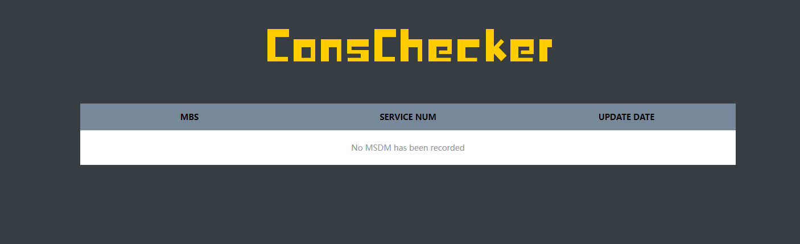

# ConsChecker Server

### 1. Architecture

The *ConsChecker Server*  includes three services:

- **Nginx Service**: It serves as both a front-end static HTML server and a reverse proxy for the **back-end service**.
- **Back-End Service**: It is used to receive and integrate the model data sent by the *ConsChecker clients*, and executes inconsistency detection.
- **Redis Service**: It is used for storing model data received from the *ConsChecker clients*. 

### 2. Deployment

We have provided a `docker-compose.yaml` to support one click deployment in Docker:

````shell
cd conschecker/conschecker-server
docker-compose up -d
````

Then enter the " http://localhost:80/ " in the browser's address bar to access the *ConsChecker Server*. The front main panel is shown as the following figure. After receiving the model data from the MBS introduced to the *ConsChecker Client*, the name of the MBS will be displayed in this list.



### 3. APIs

- **`/api/conschecker/msdm POST`**: Receive and save an MSDM model in JSON format. 

- **`/api/conschecker/mbs GET`**: Get the MBS name list.

- **`/api/conschecker/mbs/{mbsName} GET`**: Get the service name list of an MBS.

- **`/api/conschecker/service/{mbsName}/{serviceName} GET`**: Get the MSDM of a service.

- **`/api/conschecker/detection/all-config POST`**: Execute the inconsistency detection. This API needs the caller to provides two files:

  - A **scenario configuration file** following the format below

  ```json
  {
      "mbsName":"Example-MBS",
      "scenarioName":"Example-Scenario",
      "requestList":[
          {
              "serviceName":"Example-Service-1",
              "path":"/example/hello",
              "actionType":"Get"
          },
          {
              "serviceName":"Example-Service-2",
              "path":"/example/hello",
              "actionType":"Post"
          },
          ...
      ]
  }
  ```

  - A **trace file** in JSON format collected under the scenario. Note that in the next version, the function of automatically executing test scripts and collecting traces will be introduced to the *ConsChecker Server*, which can avoid manual collection of traces.

# ConsChecker Client

### 1. Architecture

The *ConsChecker Client* is introduced as a maven dependency by each Spring Boot microservice, utilizing the automatic configuration of Spring Boot to implant model extraction logic. After the model extraction is completed, the model data is sent to the *ConsChecker Server* through an HTTP request.

### 2. Introducing it to the microservice project

- Import  `conschecker-client-1.0.0.jar` and  `conschecker-common-1.0.0.jar` to your maven repository.

````bash
cd conschecker
mvn install:install-file -Dfile=conschecker-common-1.0.0.jar -DgroupId=com.nanxing -DartifactId=conschecker-common -Dversion=1.0.0 -Dpackaging=jar
mvn install:install-file -Dfile=conschecker-client-1.0.0.jar -DgroupId=com.nanxing -DartifactId=conschecker-client -Dversion=1.0.0 -Dpackaging=jar
````

- Import  the maven dependency in your Spring Boot projects

````xml
<dependency>
    <groupId>com.nanxing</groupId>
    <artifactId>conschecker-client</artifactId>
    <version>1.0.0</version>
</dependency>
````

- Configure the following  items in the Spring Boot configuration file

````yaml
conschecker:
  scanPackage: com.example # Target package name for static scanning
  MBSName: example-MBS # The name of the MBS that this microservice belongs to
  serverHost: localhost # The host of the Nginx Service in the ConsChecker Server
  serverPort: 80 # The port the Nginx Service listens to
````

Then every time the microservice is started, the *conschecker-client* generates an MSDM model for the microservice.
